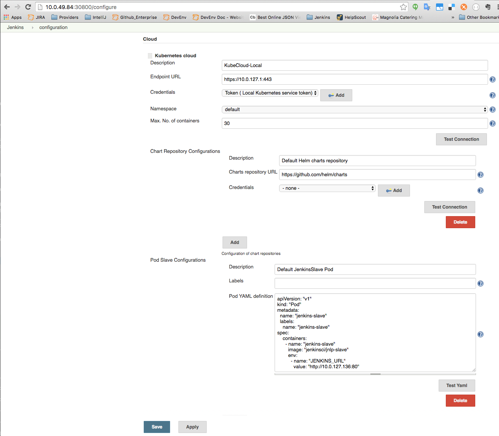
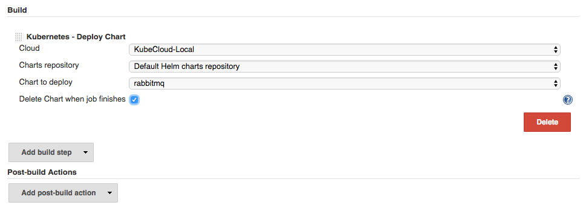

# Kubernetes CI plugin
Kubernetes CI Plugin simplifies the integration of Kubernetes and Jenkins in order to provide an easy way to implement CI/CD scenarios.

## Features
It will autodiscover the credentials and endpoint of the kube-api server if running inside a Kubernetes cluster, and configure a Kubernetes cloud object to manage it, with a default Chart repository configuration pointing to Helm charts and a default Jenkins slave Yaml definition to provision slaves into the Kubernetes cluster.

Users can add additional slave configurations or chart repositories, as well as external Kubernetes cluster configurations.
- Slave configurations consist of a list of labels and a YAML pod definition
- Chart repository configurations consist of a repository URL and the credentials (if required).

The plugin enables the deployment of charts from any chart repository configured (and its further deletion) to the local Kubernetes cloud, or to any configured Kubernetes cluster.

## Screenshots
### Cloud configuration:

### Deploy Chart build step configuration:

